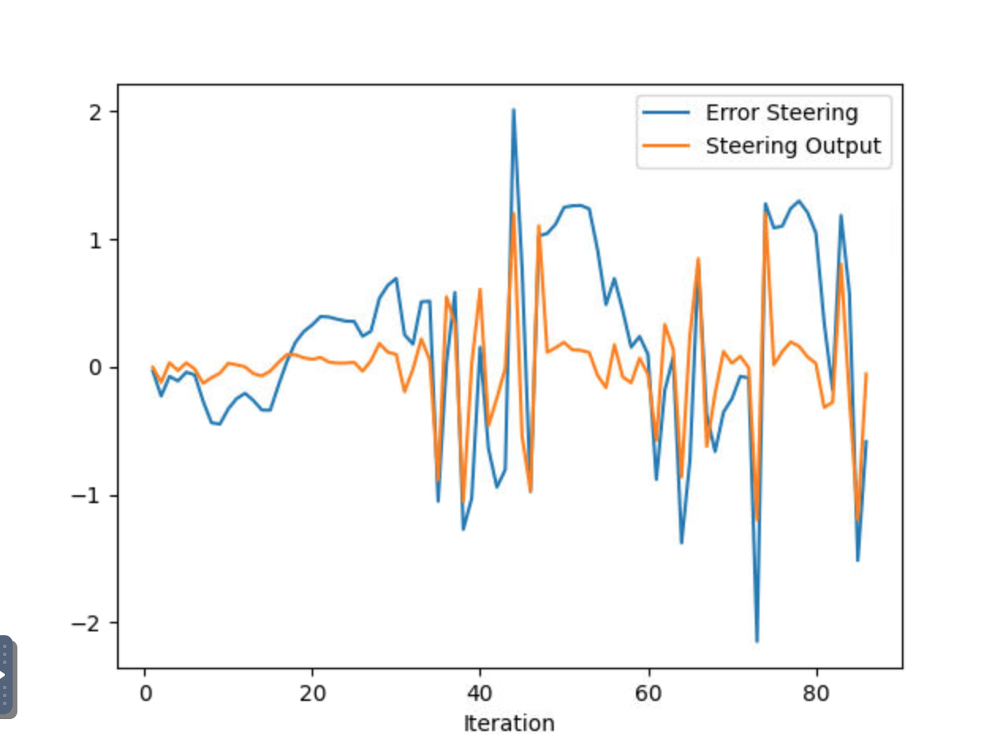
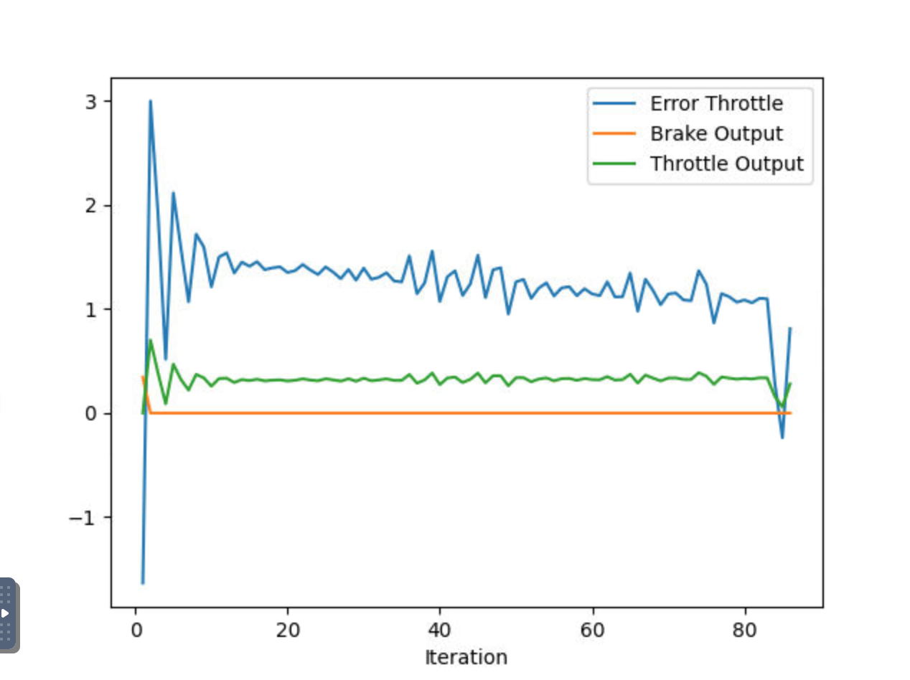
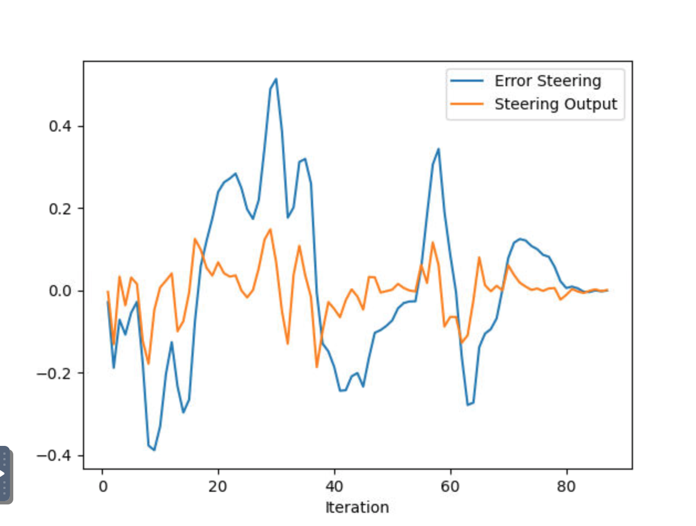
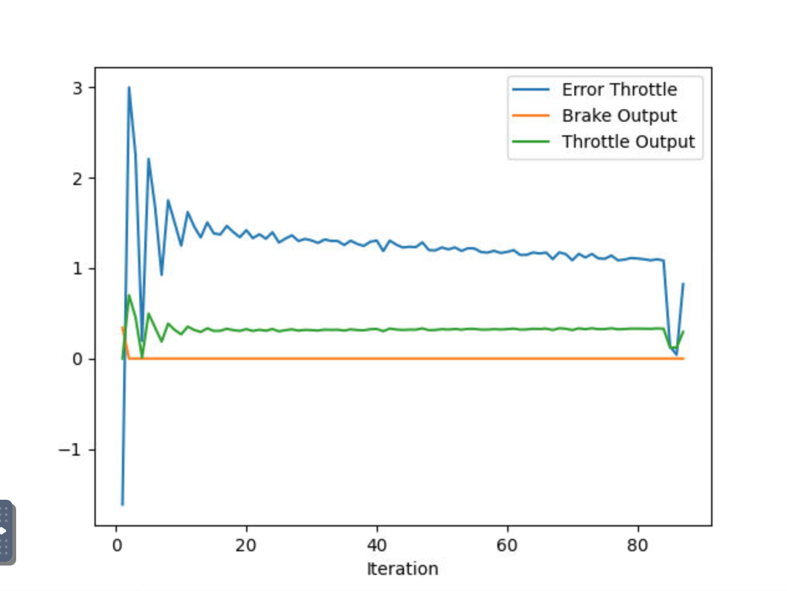
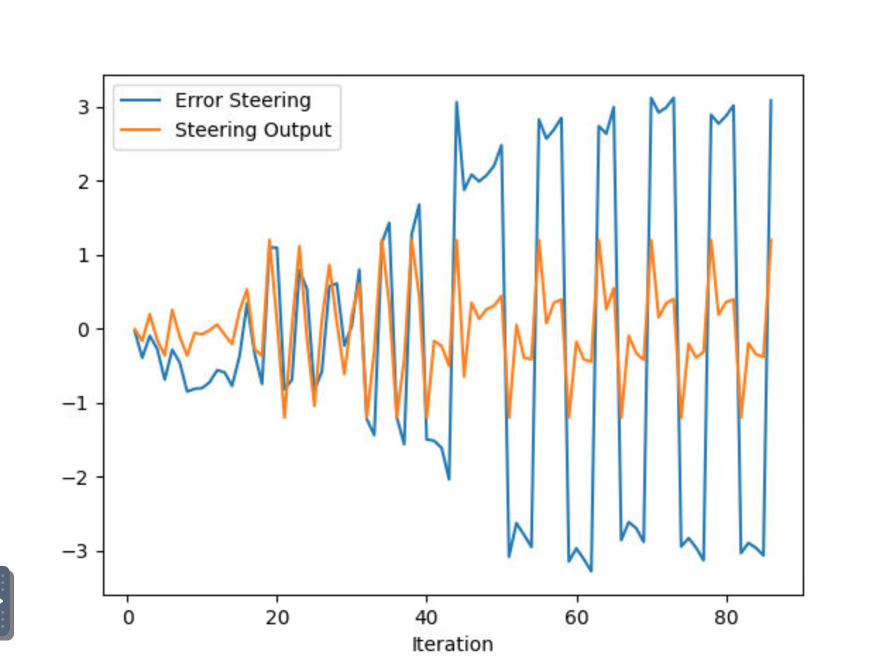
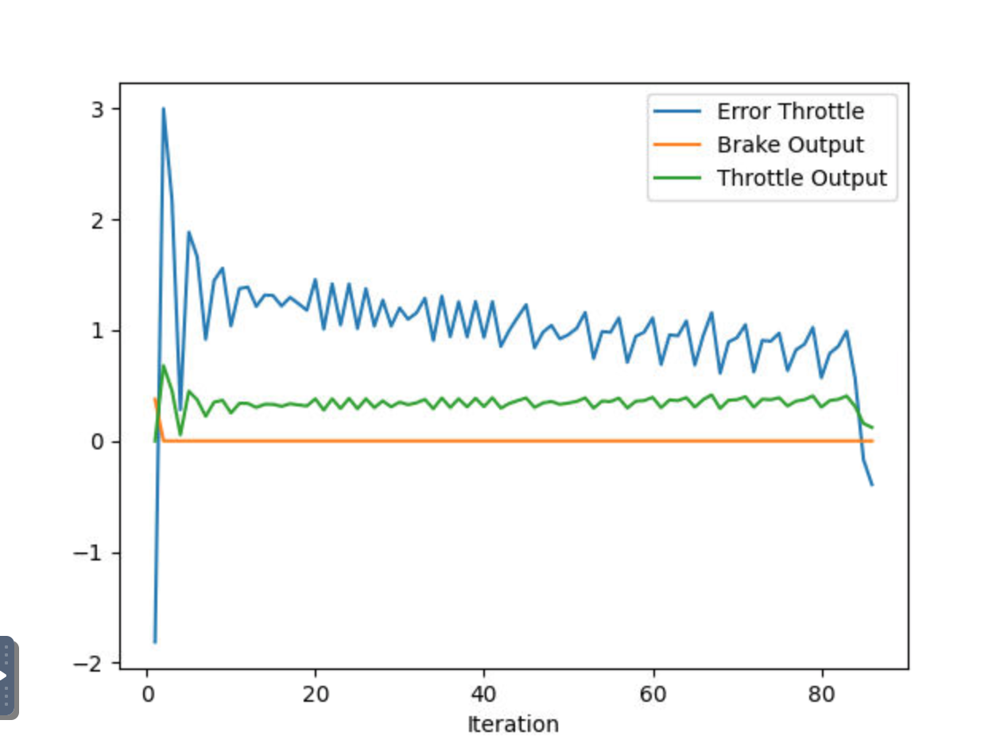

## Control and Trajectory Tracking for Autonomous Vehicle - Report

### Definitions

The PID controller is a relatively simple control system to guide a vehicle along some planned path. The controller consist of three important parameters, P (proportional), I (integral), and D (derivative). P is responsible for determining the distance to the error. For example, if a vehicle is pointed in the wrong direction, the P parameter determines the strength by which the vehicle is pulled back to the correct path. D moderates this behavior based on the distance to the planned path. As the vehicle moves toward the correct direction, D dampens the rate of correction, effectively reducing the tendency to overshoot the target, and oscillate around the correct path. I looks at the history of error in the planned versus real trajectory, and corrects for any systemic error. The exmample discusses the vehicle direction, but the same principles can be applied to velocity.

### Step 1 - Implementing the PID Controller

In the first step of the project, we implement the PID controller by initially the PID parameters, as well as limits to the control parameters.

```
void PID::Init(double Kpi, double Kii, double Kdi, double output_lim_maxi, double output_lim_mini) {
   /**
   * TODO: Initialize PID coefficients (and errors, if needed)
   **/
  this->Kpi = Kpi;
  this->Kii = Kii;
  this->Kdi = Kdi;
  this->output_lim_maxi = output_lim_maxi;
  this->output_lim_mini = output_lim_mini;
  diff_cte = 0.0;
  prev_cte = 0.0;
  sigma_cte = 0.0;
  //delta_time = 1.0;
}
```

When updating the error, we check that the time delta isn't 0, to avoid infinite values, then record the current error for P, difference in errors for D, and sum of all errors for I.

```
void PID::UpdateError(double cte) {
   /**
   * TODO: Update PID errors based on cte.
   **/
  if(delta_time==0){
  	  diff_cte = 0.0;
  	}
  else{
  	  diff_cte = (cte - prev_cte) / delta_time;
  	}
  prev_cte = cte;
  sigma_cte = cte * delta_time;
}
```

We compute the total error by multiplying each error with the respective parameter, and summing the result.

```
double PID::TotalError() {
   /**
   * TODO: Calculate and return the total error
    * The code should return a value in the interval [output_lim_mini, output_lim_maxi]
   */
    //double control;
    double control = Kpi * prev_cte + Kii * sigma_cte + Kdi * diff_cte;
    control = min(output_lim_maxi, max(output_lim_mini, control));
    return control;
}
```

With all these in place, we can run the simulator, and get a car that sits at the start position. Currently there is no error being calculated, so the car doesn't know to do anything.


### Step 2

Next, we add the error calculation for throttle to the `main.cpp`. 

```
error_throttle = v_points.back() - velocity;
```

The final point in the `v_points` vector is the current target velocity, and the `velocity` variable is the current vehicle speed. So we can simply take the difference of the two to get the velocity error. The result in the simulator is a car that will roll forward, but has no steering control. Ultimately, it collides with the first car in its path.

### Step 3

The final setup step is to add the error computation for steering.

```
error_steer = angle_between_points(x_position, y_position, x_points.back(), y_points.back()) - yaw;
```

We get the path angle by taking the angle of the current and next points in the planned path. We then get the difference between that angle and the car's current orientation.

### Tuning

After struggling for some time with parameters that generated crazy driving behavior, I used the suggested parameters in [this forum post](https://knowledge.udacity.com/questions/852715) as a baseline.

As described in the introduction, the P factor controls the strength with which the vechicle will move toward the target. D acts as a dampener, decreasing movement as the parameter approaches the target. I corrects for consistent bias by monitoring for consistent errors along the path.

Baseline values
```
  double steer_kpi =  0.1;
  double steer_kii = 0.0001;
  double steer_kdi = 0.5;

  double throttle_kpi =  0.2;
  double throttle_kii = 0.001;
  double throttle_kdi = 0.02;
```




The first plot shows the vehicle's steering angle versus the error to the planned path. The second plot shows the vehicle's current throttle, versus the error to the target velocity.

The car's steering is erratic, bouncing around, especially later in the path. The car also never reaches it's overall target velocity, though it slowly approaches it.

In the second iteration, I increase the derivative factor of the steering, in an attempt to reduce some of the oscillation.

```
  double steer_kpi =  0.1;
  double steer_kii = 0.0001;
  double steer_kdi = 0.7;

  double throttle_kpi =  0.2;
  double throttle_kii = 0.001;
  double throttle_kdi = 0.02;
```




This time the steering is much less erratic, and the error is consistently lower. While the car never reaches it's target speed, it is smoother while gradually approaching it throughout the path.

Next I tried increasing the intergral factor of the speed, to see if I could get the car to reach its target velocity.

```
  double steer_kpi =  0.1;
  double steer_kii = 0.0001;
  double steer_kdi = 0.7;
  
  double throttle_kpi =  0.2;
  double throttle_kii = 0.002;
  double throttle_kdi = 0.02;
```




While the car does come close to its target velocity, the steering is now extremely erratic. Particlarly later in the path, the car wildly swings back and forth. I tried several methods to elleviate this, further increasing the steering derivative, and reducing the proportional factor. This provided some improvement, but were still far off the second attempt.

Overall, the second attempt performed the best. The car was about 1 m/s slower than the target velocity, but the steering was relatively smooth and consistent.

### How would you design a way to automatically tune the PID parameters?

We could automatically tune the parameters with standard statistical methods. By looking at the gap, or delay, between an error and a subsequent correction, we could increase or decrease P. By looking at variance in the error, we could tune D. Finally, by watching for consistent errors, always above or below the target, we could tune I. This is partly the idea behine Twiddle, where we adjust values, and track the errors they generate.

### Could you explain the pros and cons of this type of controller?

#### Pros

The PID controller is relatively simple to implement, and requires very little computational power.

#### Cons

The PID requires a lot of tuning. Small parameter adjustments, or changes in vehicle characteristics require retuning the algorithm.

### What would you do to improve the PID controller?

The biggest way to improve would be better tuning. Implement Twiddle, or a similar algorithm, to better optimize the PID parameters. Also, perform a grid search for parameters to get the interaction behavior. For example, the results show how increasing the vehicle speed has a dramatic effect on steering. Could we develop some function to better understand and predict this relationship, so the steering can automatically adjust to new speed conditions?